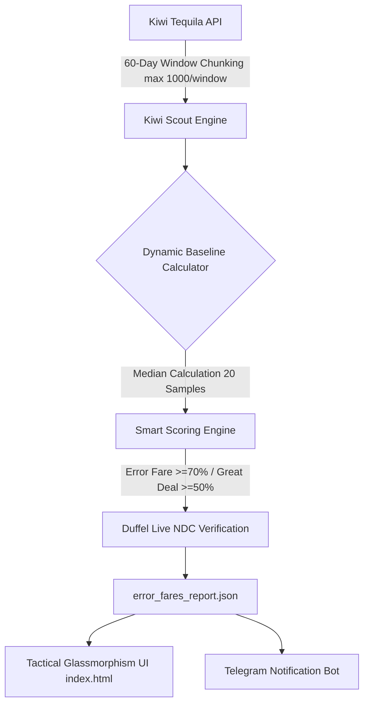

# 🔥 FlightScanner v3.5 — Global Flight Intelligence & Error Fare Hunter

[](https://radekduba.github.io/flightscanner/)
[](https://nodejs.org/)
[](LICENSE)
[](.github/workflows/deploy.yml)

**FlightScanner v3.5** is an enterprise-grade, real-time flight deal intelligence and error fare detection platform. Designed with a **Tactical Glassmorphism HUD** and an interactive **3D Vector Globe**, it automatically scouts, scores, cross-verifies, and visualizes 100% direct flights from Central European hubs to destinations worldwide.

🔗 **Live Application**: [https://radekduba.github.io/flightscanner/](https://radekduba.github.io/flightscanner/)

---

## 🚀 Key Features

* **🧠 Smart Insights Engine**: Executive ticker summarizing active deals, price crashes, top discounts, and live error fares in real time.
* **⚡ 60-Day Date-Window Chunking**: Divides the 300-day booking horizon into 5 distinct 60-day windows requesting up to 1,000 direct flight offers per window, ensuring **100% exhaustive direct flight coverage** out of PRG, VIE, BTS, KTW, and OSR.
* **🗺️ 3D MapTiler Vector Globe**: Interactive high-performance 3D canvas featuring curved flight paths, pulsing destination nodes, and dynamic atmospheric fog.
* **🎯 Unified Bi-Directional Sync**:
  * **Card Hover/Click**: Highlights the card, isolates its specific flight arc on the 3D map, and opens the detail drawer.
  * **Map Pin / Arc Hover/Click**: Highlights the matching route on the map, lights up the corresponding deal card in the list, and opens itinerary details.
* **📊 Dynamic Market Baselines**: Calculates route medians across 20+ sample dates over a 6-month window to distinguish genuine price anomalies from standard low-cost carrier (LCC) pricing.
* **🔍 Live Duffel NDC Verification**: Cross-checks flagged error fares directly against Duffel's live airline API to confirm ticket availability before alerting.
* **📲 Multi-Channel Alerts**: Automated Telegram bot integration (`notify_bot.js`) for instant notifications on verified error fares (70%+ off baseline).

---

## ✈️ Supported Origin Hubs

| Airport | Code | Location | Coverage Strategy |
| :--- | :---: | :--- | :--- |
| **Prague Airport** | `PRG` | Czech Republic | Exhaustive 60d window scan (~120 direct destinations) |
| **Vienna International** | `VIE` | Austria | Exhaustive 60d window scan (~190 direct destinations) |
| **Katowice Airport** | `KTW` | Poland | Exhaustive 60d window scan (Wizz Air / Ryanair Base) |
| **Bratislava Airport** | `BTS` | Slovakia | Complete direct route coverage |
| **Ostrava Airport** | `OSR` | Czech Republic | Complete direct route coverage |

---

## 🛠️ Architecture & Data Pipeline



1. **Scout Phase**: Runs 60-day chunked queries (`max_stopovers=0`) across origin hubs to capture all non-stop direct flights.
2. **Scoring Phase**: Computes route-specific market medians to score deals (`ERROR FARE`, `GREAT DEAL`, `GOOD DEAL`, `NORMAL`).
3. **Verification Phase**: Queries Duffel NDC endpoints for live pricing confirmation.
4. **Publishing & UI**: Deploys updated reports to GitHub Pages and broadcasts high-priority alerts to Telegram.

---

## 📁 Repository Structure

```
flightscanner/
├── index.html                 # Tactical Glassmorphism Single-Page App (MapTiler + MapLibre GL JS)
├── error_fare_hunter.js       # Core hunter script (Scout + Score + Verify pipeline)
├── scan_keys.js               # Health checker and key validator for API pools
├── flight_search.js           # Duffel API direct client integration
├── history_db.js              # Historical price drop tracker & price crash detection
├── combo_scanner.js           # Hub-and-spoke self-transfer combo generator
├── notify_bot.js              # Telegram alert dispatcher
├── error_fares_report.json    # Published deal dataset (updated hourly)
└── .github/workflows/
    ├── deploy.yml             # Hourly GitHub Actions build, scan & Pages deploy pipeline
    └── scan-keys.yml          # Daily API key maintenance workflow
```

---

## 💻 Local Setup & Development

### Prerequisites
* **Node.js**: v22 LTS or higher
* **npm**: v10+

### Installation

```bash
# Clone repository
git clone https://github.com/RadekDuba/flightscanner.git
cd flightscanner

# Install dependencies (if any)
npm install
```

### Running Scans Locally

```bash
# Verify API keys
npm run scan

# Run full error fare hunter scan
npm run hunt

# Run scan with fresh baseline cache
npm run hunt -- --fresh
```

### Serving the Dashboard Locally

```bash
# Start local preview server
npm run map
```
Then navigate to `http://localhost:3000` in your browser.

---

## 📜 License

Distributed under the **MIT License**. See `LICENSE` for details.
